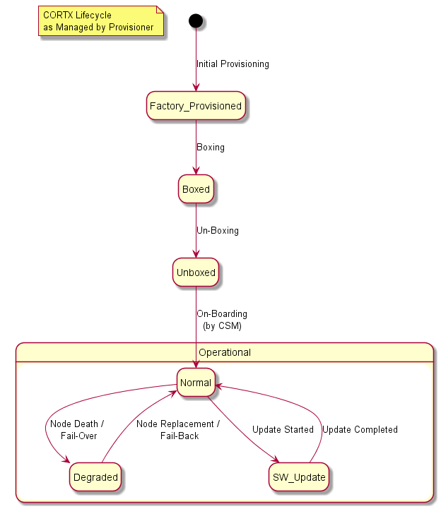

# Introduction to Provisioner

Current version: **0.1** 

## Informational

### Table of Content

- [Introduction to Provisioner](#introduction-to-provisioner)
  - [Informational](#informational)
    - [Table of Content](#table-of-content)
    - [Document history](#document-history)
  - [Overview](#overview)
  - [Operations Performed by Provisioner](#operations-performed-by-provisioner)
  - [How Provisioner Interacts With Other Components](#how-provisioner-interacts-with-other-components)
    - [Northbound Interface](#northbound-interface)
    - [Southbound Interface](#southbound-interface)

### Document history

| Revision | Revision date | Author           | Description |
| -------- | :-----------: | ---------------- | ----------- |
| 0.1      | 2020-10-20    | Ivan Tishchenko  | Initial release |

## Overview

See [README.md](../README.md).

## Operations Performed by Provisioner

CORTX stack goes through certain stages in it's lifecycle.  Below is the diagram which highlights some of these stages, related to and managed by Provisioner.

* Initial Provisioning: [Auto-Deploy-Provisioner-CLI-Commands](https://github.com/Seagate/cortx-prvsnr/wiki/Auto-Deploy-Provisioner-CLI-Commands).
  * For reference -- manual for VM-based environment: [Auto-Deploy-VM-Provisioner-CLI-Commands](https://github.com/Seagate/cortx-prvsnr/wiki/Auto-Deploy-VM-Provisioner-CLI-Commands).
* Boxing & Un-Boxing: [Box-Unbox](https://github.com/Seagate/cortx-prvsnr/wiki/Box-Unbox).
* CSM On-Boarding: [CORTX Management Portal Quick Start](https://github.com/Seagate/cortx-management-portal/blob/main/docs/CortxManagementPortalQuickstart.md), sections Preboarding and Onboarding.
* Fail-over -- is managed by HA.  No doc available.
* Node Replacement: [Node-Replacement](https://github.com/Seagate/cortx-prvsnr/wiki/Node-Replacement).
  * Extra docs by HA (not sure how relevant):
    [Node-Replacement](https://github.com/Seagate/cortx-ha/wiki/Node-Replacement), and
    [CORTX-HA-Replace-Node](https://github.com/Seagate/cortx-ha/wiki/Cortx-ha-Replace-Node).
* SW Update: [Software-Updates](https://github.com/Seagate/cortx-prvsnr/wiki/Software-Updates).

## How Provisioner Interacts With Other Components

### Northbound Interface

Provisioner exposes an API which other components may use to run certain operations through Provisioner.

Main page: [Northbound-Interface](Architecture/Northbound-Interface.md).

This API is exposed in 3 forms:

* Library (python module).
* CLI (main entry point is command-line utility called `provisioner`; run `provisioner --help` for list of available commands).
* CLI-wrapper library. It's a python module, but it's "decoupled" from main library listed above, and does not inherit external dependencies/imports on other modules (which main library has).  This allows for special strict linkage of this python module, e.g. in a form of python frozen app (dependencies are minimized in this case).

Please check [api docs](api/python/README.md) for more details.

### Southbound Interface

This is an interface which must be supported by every CORTX component to enable it with Provisioner.

Main page: [Southbound-Interface](Architecture/Southbound-Interface.md).

In a nutshell: Provisioner defines certain stages/actions (e.g. post-install, or config update), and every component defines (in `setup.yaml`) which component-specific commands must be run during a given stage by Provisioner.
