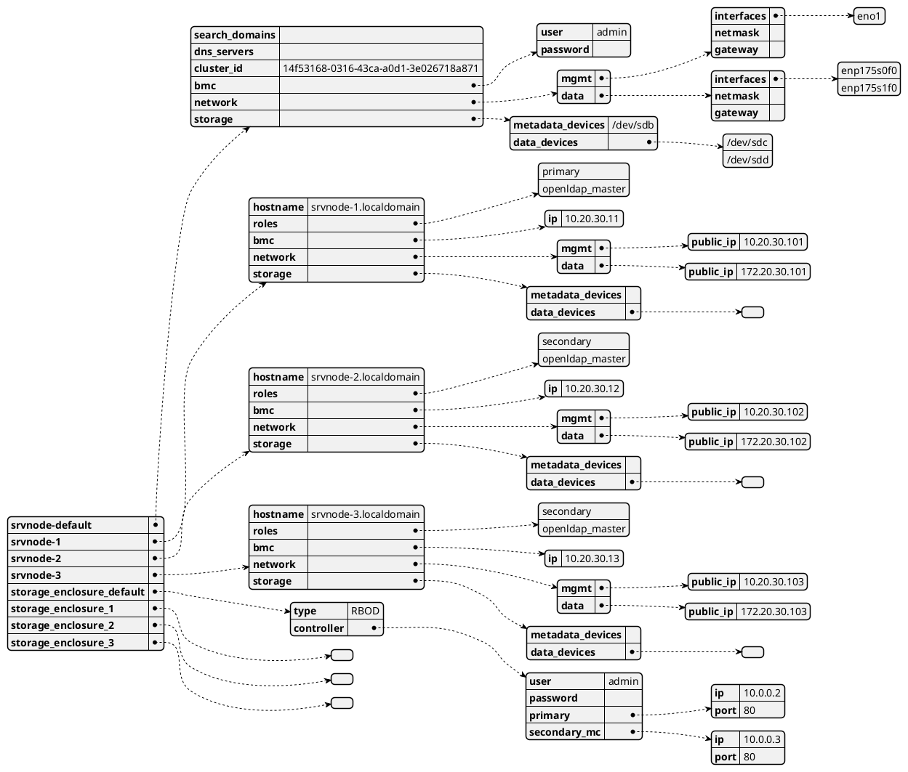
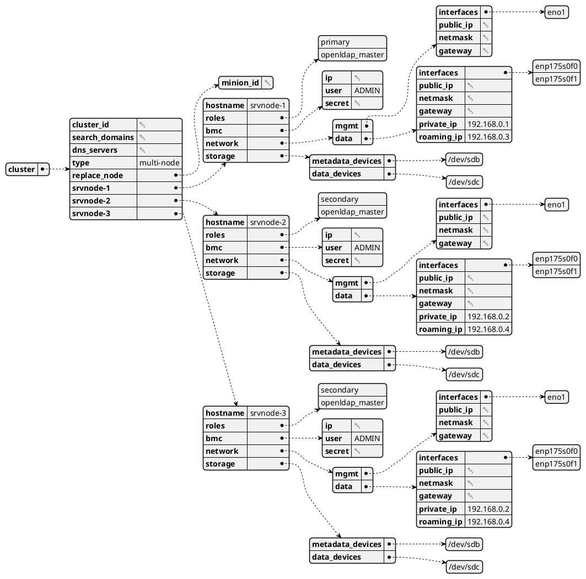
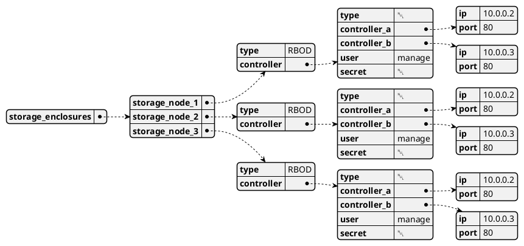

# Cluster Config Schema
<!-- Ref: https://plantuml.com/json -->

## config.ini
`config.ini` is a basic user input to capture configuration of the cluster data.  
These are the bare minimal values that cannot be captured automatically by direct system call.  
Or when a direct system call would return values, requiring human validation.  

### Guidelines & Rules
1.  `storage_enclosure_*` are the sections that capture the information related to the storage enclosures  

1.  `srvnode-*` are the sections that capture the information related to the server nodes  

1.  The sections suffixed with **default** are the sections that are intended to capture the default values. These are the values that are common across all the nodes (server/storage enclosure).  
    *  storage_enclosure_default: Captures information that is common across all storage enclosures in cluster.  
    *  srvnode-default: Captures the information that is common across all server nodes in cluster.  

    **_NOTE: The default section avoids repetition and thus chances of human error due to copy paste activities. Also, this reduces the size of the config.ini file._**  

1.  The sections with a numeral suffix act as node identities for storage sets in the target cluster  
    E.g. `storage_enclosure_1` for **_storage enclosure 1_** in cluster & `srvnode-1` for **_server node 1_** in the same target cluster

1.  It is necessary to maintain all the sections with numeral suffix, as it helps affixing the count of the participating nodes  

1.  The values of information unique to the node, which could not be captured in default section, are captured in sections with a numeral suffix  
    E.g. Management IP

1.  Entries in default section could be over-ridden in the numeral suffixed sections. Such over-rides shall be uniquely applied to the targeted node as a special case  

1. Blank entries do not harm. To reset an entry in Salt pillar, a particular key entry has to be furnished with value: **PRVSNR_UNDEFINED**  


### Reference config.ini file
A diagramatic representation of the _config.ini_ data structure  

<!-- 

-->

config.ini file sample:  
```
[srvnode-default]
search_domains=
dns_servers=
cluster_id="14f53168-0316-43ca-a0d1-3e026718a871"
bmc.user=ADMIN
bmc.secret=
network.mgmt.interfaces=eno1
network.mgmt.netmask=
network.mgmt.gateway=
network.data.interfaces=enp175s0f0, enp175s1f1
network.data.netmask=
network.data.gateway=
storage.metadata_devices="/dev/sdb"
storage.data_devices="/dev/sdc","/dev/sdd"

[srvnode-1]
hostname=srvnode-1.localhost
roles=primary,openldap_master
bmc.ip=10.20.30.11
network.mgmt.public_ip=10.20.30.101
network.data.public_ip=172.20.30.101

[srvnode-2]
hostname=srvnode-2.localhost
roles=secondary,openldap_master
bmc.ip=10.20.30.12
network.mgmt.public_ip=10.20.30.102
network.data.public_ip=172.20.30.102

[srvnode-3]
hostname=srvnode-3.localhost
roles=secondary,openldap_master
bmc.ip=10.20.30.13
network.mgmt.public_ip=10.20.30.103
network.data.public_ip=172.20.30.103

[storage_enclosure_default]
type=RBOD
controller.primary.ip=10.0.0.2
controller.secondary_mc.ip=10.0.0.3
controller.user=manage
controller.secret=
controller.type=RBOD

[storage_enclosure_1]

[storage_enclosure_2]

[storage_enclosure_3]
```
**Repo path**: https://github.com/Seagate/cortx-prvsnr/blob/main/pillar/samples/config.ini  


## cluster.sls & storage.sls
These files are used as reference data by Salt in form of Salt Pillar.  
These files hold data specific to Server and Storage nodes:  

### cluster.sls
Pillar data related to the server nodes is captured in this file.  
A diagramatic representation of the _cluster.sls_ data structure  

<!-- 

-->

Sample _cluster.sls_ file:  
```
cluster:
  cluster_id:                         # Cluster ID from user or auto-generated by code
  search_domains:                     # Do not update
  dns_servers:                        # Do not update
  type: multi-node                    # single/dual/generic/multi-node
  replace_node:
    minion_id: null                   # Could be srvnode-1, srvnode-2 or something similar
  srvnode-1:
    hostname: srvnode-1
    roles:                            # Could have more than one roles, only is_primary accepted from user
      - primary                       # Picked from config.ini
      - openldap_master
    bmc:
      ip:
      user: ADMIN
      secret:
    network:
      mgmt:                        # Management network interfaces
        interfaces:
          - eno1
        public_ip:               # DHCP is assumed if left blank
        netmask:
        gateway:                      # Gateway IP of Management Network. Not requried for DHCP.
      data:                        # Data network interfaces
        interfaces:
          - enp175s0f0                # Public Data
          - enp175s0f1                # Private Data (direct connect)
        public_ip:                       # DHCP is assumed if left blank
        netmask:
        gateway:                      # Gateway IP of Public Data Network. Not requried for DHCP.
        private_ip: 192.168.0.1      # Fixed IP of Private Data Network
        roaming_ip: 192.168.0.3       # Applies to private data network
    storage:
      metadata_devices:               # Device for /var/motr and possibly SWAP
        - /dev/sdb                    # Auto-populated by components.system.storage.multipath
      data_devices:                   # Data device/LUN from storage enclosure
        - /dev/sdc                    # Auto-populated by components.system.storage.multipath
  srvnode-2:
    hostname: srvnode-2
    roles:                            # Could have more than one roles, only is_primary accepted from user
      - secondary                     # Picked from config.ini
      - openldap_master
    bmc:
      ip:
      user: ADMIN
      secret:
    network:
      mgmt:                        # Management network interfaces
        interfaces:
          - eno1
        public_ip:               # DHCP is assumed if left blank
        netmask:
        gateway:                      # Gateway IP of Management Network. Not requried for DHCP.
      data:                        # Data network interfaces
        interfaces:
          - enp175s0f0                # Public Data
          - enp175s0f1                # Private Data (direct connect)
        public_ip:               # DHCP is assumed, if left blank
        netmask:
        gateway:                      # Gateway IP of Public Data Network. Not requried for DHCP.
        private_ip: 192.168.0.2      # Fixed IP of Private Data Network
        roaming_ip: 192.168.0.4       # Applies to private data network
    storage:
      metadata_devices:               # Device for /var/motr and possibly SWAP
        - /dev/sdb
      data_devices:                   # Data device/LUN from storage enclosure
        - /dev/sdc
  srvnode-3:
    hostname: srvnode-3
    roles:                            # Could have more than one roles, only is_primary accepted from user
      - secondary                     # Picked from config.ini
      - openldap_master
    bmc:
      ip:
      user: ADMIN
      secret:
    network:
      mgmt:                        # Management network interfaces
        interfaces:
          - eno1
        public_ip:                       # DHCP is assumed if left blank
        netmask:
        gateway:                      # Gateway IP of Management Network. Not requried for DHCP.
      data:                        # Data network interfaces
        interfaces:
          - enp175s0f0                # Public Data
          - enp175s0f1                # Private Data (direct connect)
        public_ip:               # DHCP is assumed, if left blank
        netmask:
        gateway:                      # Gateway IP of Public Data Network. Not requried for DHCP.
        private_ip: 192.168.0.2      # Fixed IP of Private Data Network
        roaming_ip: 192.168.0.4       # Applies to private data network
    storage:
      metadata_devices:               # Device for /var/motr and possibly SWAP
        - /dev/sdb
      data_devices:                   # Data device/LUN from storage enclosure
        - /dev/sdc
```  
  
### storage.sls
Pillar data related to the server nodes is captured in this file.
A diagramatic representation of the _cluster.sls_ data structure  

<!-- 

-->

Sample _storage_enclosure.sls_ file:  
```
storage_enclosures:
    storage_node_1:               # equivalent to fqdn for server node
      type: RBOD                    # RBOD/JBOD/Virtual/Other
      controller:
        type: null
        controller_a:
          ip: 10.0.0.2
          port: 80
        controller_b:
          ip: 10.0.0.3
          port: 80
        user: manage
        secret:
    storage_node_2:               # equivalent to fqdn for server node
      type: RBOD                    # RBOD/JBOD/Virtual/Other
      controller:
        type: null
        controller_a:
          ip: 10.0.0.2
          port: 80
        controller_b:
          ip: 10.0.0.3
          port: 80
        user: manage
        secret:
    storage_node_3:               # equivalent to fqdn for server node
      type: RBOD                    # RBOD/JBOD/Virtual/Other
      controller:
        type: null
        controller_a:
          ip: 10.0.0.2
          port: 80
        controller_b:
          ip: 10.0.0.3
          port: 80
        user: manage
        secret:
```  
  
**Notice** here that there is no **srvnode-default** section here unlike config.ini. The reason being config.ini is supposed to be user editable, whereas cluster.sls (a salt pillar file) is code readable & editable. Repeated values here are better than the overhead of checking the override in each state file or reference in code for any of these values, which would make the code vulnerable to programmer error.  
  
# Extras
JQ query to filter server nodes  
`.cluster|with_entries( select(.key | contains("srvnode-") ) )`
